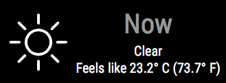

# MMM-Weather-Now


This a module for the [MagicMirror](https://github.com/MichMich/MagicMirror/tree/develop).  This module shows weather conditions now using the Wunderground API.  This is designed to compliment the [MMM-3Day-Forecast](https://github.com/nigel-daniels/MMM-3Day-Forecast) module.<br>  
**Note:** The Weather company has ceased the free API that this module was based on, as a result this is now based on the API offered by [BitWeather](https://www.weatherbit.io). If you are updating to this version then please don't forget to update your config too!

## Installation
1. Navigate into your MagicMirror's `modules` folder and execute `git clone https://github.com/nigel-daniels/MMM-Weather-Now`.  A new folder `MMM-Weather-Now` will appear, navigate into it.
2. Execute `npm install` to install the node dependencies.

## Config
The entry in `config.js` can include the following options:

|Option|Description|
|---|---|
|`api_key`|**Required** This is the API key you need to use to request weather data from the Weather Underground site.  Details on how to request an API key can be found [here](https://www.weatherbit.io/account/create)<br><br>**Type:** `string`<br>**Default value:** `null`|
|`lat`|This is the latitude of the location you want to get the weather for.<br><br>**Type:** `number`<br>**Default value:** `0.0`|
|`lon`|This is the longitude of the location you want to get the weather for.<br><br>**Type:** `number`<br>**Default value:** `0.0`|
|`units`|This is the units you want the weather reporting in.<br><br>**Type** `string` Use `M` for metric OR `I` for imperial.<br>**Default value:** `M`|
|`lang`|This is the two character country code for the language you want the weather in, see all the supported codes [here](https://www.weatherbit.io/api/weather-current).\*<br><br>**Type** `string`<br>**Default value** `en`|
|`tableView`|This switches the look to use a more compact table based view.<br><br>**Type** `boolean`<br>**Default value** `false`|
|`interval`|How often the weather is updated.<br><br>**Type:** `integer`<br>**Default value:** `900000 // 15 minutes`|

\* This module itself only currently supports `da`, `en` and `nb` for the text 'Now' and 'Feels like'.  If you have translations for these please send them over and I'll add your language to the set I can support :)

Here is an example of an entry in `config.js`
```
{
	module: 	'MMM-Weather-Now',
	position: 	'top_right',
	config: {
		api_key:    'xxxxxxxxxxxxxxxxxxxxxx',
		lat:		37.3397352,
		lon:		-121.894958,
		units:		'M',
		lang:		'en',
		interval:   900000
	}
},
```

## Dependencies
- [request](https://www.npmjs.com/package/request) (installed via `npm install`)

## Notes
I hope you like this module, I know it duplicates many other weather modules, however I missed my home-brew mirrors weather information so I recreated it for MM2.  Feel free to submit pull requests or post issues and I'll do my best to respond.

## Thanks To...
- [Michael Teeuw](https://github.com/MichMich) for the [MagicMirror2](https://github.com/MichMich/MagicMirror/tree/develop) framework that made this module possible.
- [Sam Lewis](https://github.com/SamLewis0602) whose [MMM-Traffic](https://github.com/SamLewis0602/MMM-Traffic) module I use and whose code I learnt a great deal from.
- [BitWeather](https://www.weatherbit.io) for the helpful guides and information they publish on their API.
